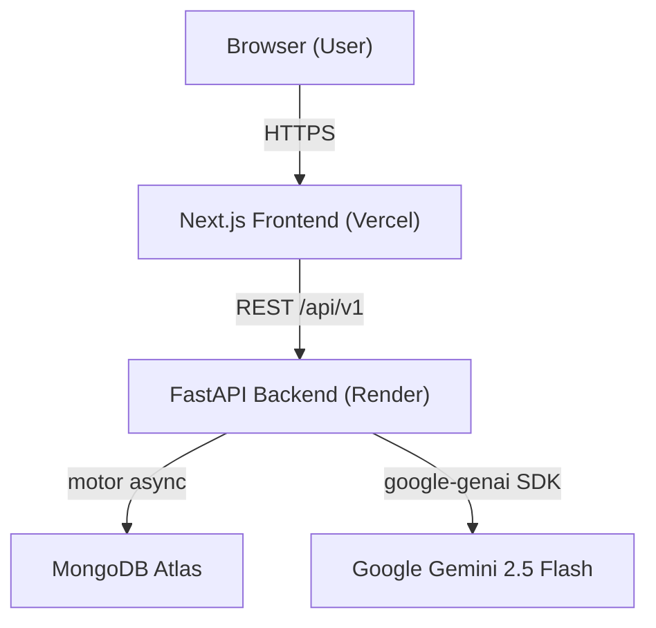

# 🌸 WeCare - AI Mental Health Companion

> **A compassionate AI-powered platform for mental health awareness, mood tracking, and emotional support.**


---

## 🌟 Project Overview

**WeCare** is an AI-assisted mental health awareness and self-reflection platform designed to provide proactive emotional insights. Acting as an interactive digital sanctuary, WeCare utilizes Google's Gemini 2.5 Flash to read, analyze, and reframe user inputs via established Cognitive Behavioral Therapy (CBT) frameworks. It bridges the gap between passive journaling and active therapy.

## 🔗 Live Demo

- **Application URL:** [https://we-care-one-navy.vercel.app/](https://we-care-one-navy.vercel.app/)

## ✨ Features

- **🎭 Real-time Mood Analysis:** AI-powered emotional intelligence using Google Gemini with structured CBT response frameworks.
- **🧠 Cognitive Load Engine:** Evaluates implicit user distress (typing speed, backspaces) to provide additional context to the AI model.
- **📊 Mood Tracking & Visualization:** Interactive GitHub-style streak heatmaps and emotional trajectory line charts.
- **🚨 Crisis Intervention:** Immediate regex-layer detection of critical keywords bypassing the LLM to provide instant hotline resources.
- **🎧 Sonic Therapy:** Embedded Spotify playlists dynamically matched to the user's emotional state.
- **🪴 Zen Garden:** A gamified, visually evolving digital plant representing the user's consistency and streak.
- **🧘 Focus Timer:** Built-in Pomodoro tool overlaid with a breathing visualizer.
- **🗑️ Thought Shredder:** An interactive Cognitive Defusion tool for temporary rumination relief.
- **🎨 Premium UI/UX:** Glassmorphic, 3D-integrated interfaces designed for minimum emotional friction.

---

## 🛠️ Tech Stack

### Frontend
- **Framework:** Next.js 14 (React 18)
- **Styling:** Tailwind CSS with custom design tokens
- **Animations:** Framer Motion, Three.js (React Three Fiber)
- **Charts:** Recharts
- **Hosting:** Vercel

### Backend
- **Framework:** FastAPI (Python 3.9+)
- **AI Engine:** Google Gemini API (Gemini 2.5 Flash)
- **Database:** MongoDB Atlas (accessed via `motor` async driver)
- **Hosting:** Render (Free Tier)

---

## 🏗️ Architecture Overview

WeCare implements a decoupled service architecture.



## 🔄 System Workflow

1. **User Input:** The user logs their mood, text notes, and the frontend calculates a "Cognitive Load Score".
2. **Safety Check:** The backend routes the data to `gemini_client.py`, which first runs a local Regex Crisis check.
3. **Context Injection:** The database retrieves the last 5 entries to give the LLM longitudinal context.
4. **AI Generation:** The prompt and JSON schema are sent to Gemini, which returns a structured Summary, Insight, CBT Reframe, and Action plan.
5. **UI Rendering:** The Next.js frontend beautifully maps the JSON response into distinct UI cards.

---

## 🚀 Installation Guide

### Prerequisites

- **Node.js** 18+ and npm
- **Python** 3.9+
- **Google Gemini API Key** ([Get one here](https://aistudio.google.com/app/apikey))
- **MongoDB Atlas Cluster**

### 1️⃣ Clone the Repository

```bash
git clone https://github.com/gopalkaushik03/WeCare.git
cd WeCare
```

### 2️⃣ Frontend Setup

```bash
# Install dependencies
npm install
```

### 3️⃣ Backend Setup

```bash
cd backend

# Create virtual environment
python -m venv venv

# Activate virtual environment
# On Windows:
venv\Scripts\activate
# On macOS/Linux:
source venv/bin/activate

# Install dependencies
pip install -r requirements.txt
```

---

## 🔐 Environment Variables

You need to set up `.env.local` in the **root directory** and `.env` in the **backend directory**.

**Backend (`backend/.env`):**
```ini
GEMINI_API_KEY=your_gemini_api_key_here
MONGODB_URI=your_mongodb_connection_string
MONGODB_DB=wecare
```

**Frontend (`.env.local`):**
```ini
NEXT_PUBLIC_API_URL=http://localhost:8000/api/v1
```

---

## 💻 Running Locally

### Start the Frontend

```bash
# From the root directory
npm run dev
```
The frontend will be available at **http://localhost:3000**

### Start the Backend

```bash
# From the backend directory, with venv activated
uvicorn main:app --reload --port 8000
```
The backend API will be available at **http://localhost:8000**

---

## ☁️ Deployment Details

- **Frontend:** Hosted seamlessly on **Vercel**. Connects directly to the GitHub repository.
- **Backend:** Deployed as a web service on **Render Free Tier**.
- ⚠️ **Note on Render Cold Starts:** Because the backend is hosted on Render's free tier, the server may "spin down" after a period of inactivity. **The first request to the mood entry or dashboard after a period of rest may take 30-50 seconds to complete.** Subsequent requests will be fast.

---

## 🔌 API Overview

The FastAPI backend exposes the following primary RESTful endpoints under `/api/v1`:

- `POST /api/v1/analyze`: Synchronously processes the mood and journal text against the Gemini LLM.
- `POST /api/v1/entries`: Persists the AI result and user entry to MongoDB.
- `GET /api/v1/entries`: Fetches recent historical entries for dashboards.
- `GET /api/v1/entries/streak`: Calculates and returns the user's current interaction streak.
- `GET /api/v1/me/trajectory`: Returns data mapped for the linear regression chart.

---

## 🗄️ Database Schema Overview

WeCare utilizes **MongoDB Atlas** with `motor` (async driver) and strictly validates reads/writes using Pydantic models.

- `users (Phase 2)`: Identity tracking parameters.
- `mood_entries`: Core collection storing explicit notes, implicit Cognitive Load Scores, and the nested, parsed AI CBT reframes.
- `analysis_logs`: Audit collection maintaining a timestamped record and prompt excerpts for AI debugging and tracking.

---

## 🔮 Future Improvements

- **Full User Authentication:** Migrating from simulated `local_user` logic to robust JWT/OAuth implementations (e.g., Clerk or NextAuth).
- **Emotion Prediction Models:** Utilizing Random Forest or LSTM models to preemptively forecast depressive dips based on entry history.
- **Biometric Input Integration:** Exploring optical-flow webcam processing for physiological stress assessment.
- **Enhanced Crisis Layer:** Upgrading from local Regex to an offline smaller SLM (Small Language Model) for better nuance detection.

---

## 🤝 Contributing

Contributions are welcome! Please follow these steps:

1. Fork the repository
2. Create a feature branch (`git checkout -b feature/AmazingFeature`)
3. Commit your changes (`git commit -m 'feat: Add some AmazingFeature'`)
4. Push to the branch (`git push origin feature/AmazingFeature`)
5. Open a Pull Request targeting the `main` branch.

---

## 📄 License

This project is licensed under the MIT License - see the LICENSE file for details.

---

**Made with 💙 for mental health awareness**
